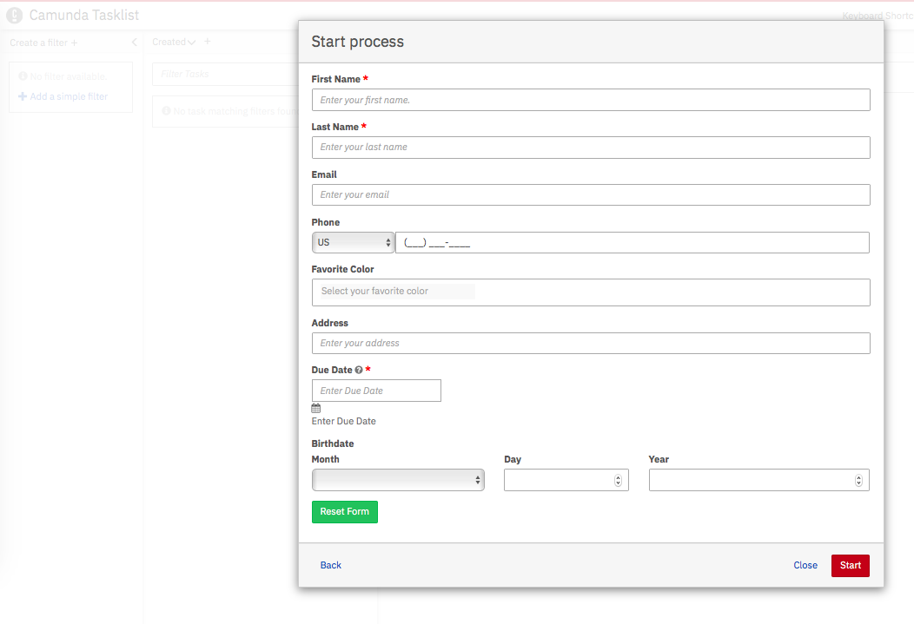
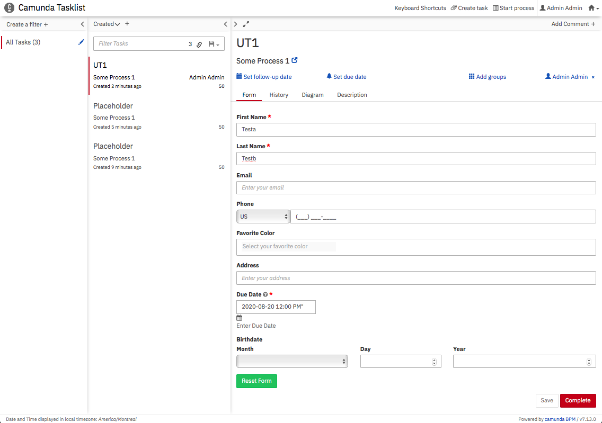
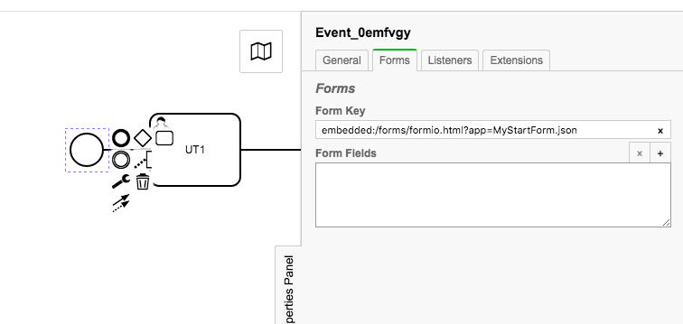
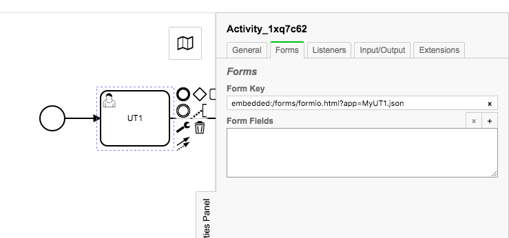
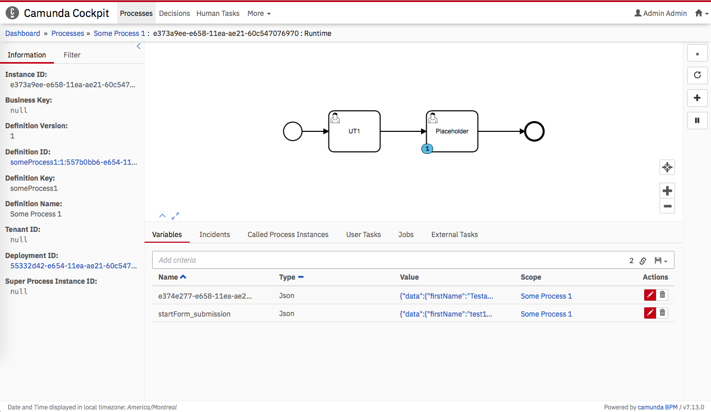
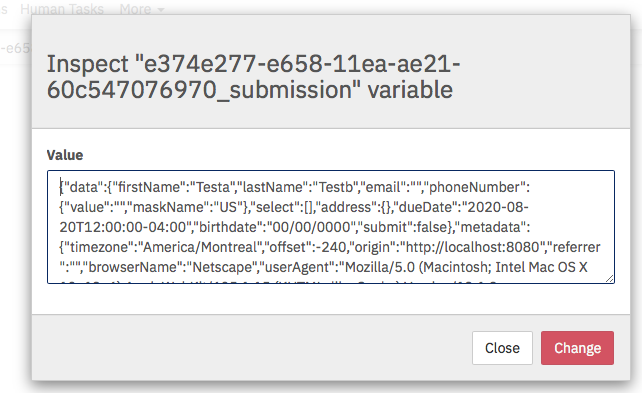

# Camunda Formio Plugin

Provides integration for using Camunda Embedded Forms with Formio Form Renderer.

Using Formio for a Start Form:

> 

Using Formio for User Tasks:

> 


## What does it do?

Allows you to configure start-event forms and user-task forms with a `formkey` that can trigger formio form renders in Camunda Tasklist webapp.


## Configure the BPMN

Configuring a Start Form:

`embedded:/forms/formio.html?deployment=MyStartForm.json`

>

Configuring a User Task:

`embedded:/forms/formio.html?deployment=MyUT1.json`

>


## Submission storage

When a successful submission occurs, a `json` variable will be created in the process instance variables using the 
following logic:

   - Start Form Submissions: `startForm_submission`
   - User Tasks: `[taskId]_submission`


### Resolving User Task `taskId` to more meaningful values

Very often the taskID (which is typically a UUID) will not be very meaningful.  If you require more meaningful variable name 
consider using the Activity ID (the `id` property when you are in the Modeler on a user task activity).

Use input/output mappings to control modification of the variables.


## Building Forms:

You can build your form and copy the JSON from: [https://formio.github.io/formio.js/app/builder](https://formio.github.io/formio.js/app/builder`)

Remove the `Submit` button as it is not required / it will not be used.


## Deploying your Forms
 
Forms can be deployed through the REST API.  The form JSON must be part of the same deployment as the BPMN.
 
An example of using Postman to deploy:
 

 
 
## Example Submission
 
> 

> 
 
 ```json
{
  "data": {
    "firstName": "SomeFirstName",
    "lastName": "SomeLastName",
    "email": "",
    "phoneNumber": {
      "value": "",
      "maskName": "US"
    },
    "select": [],
    "address": {},
    "dueDate": "2020-08-18T12:00:00-04:00",
    "birthdate": "00/00/0000",
    "submit": false
  },
  "metadata": {
    "timezone": "America/Montreal",
    "offset": -240,
    "origin": "http://localhost:8080",
    "referrer": "http://localhost:8080/camunda/app/welcome/default/",
    "browserName": "Netscape",
    "userAgent": "Mozilla/5.0 (Macintosh; Intel Mac OS X 10_13_6) AppleWebKit/605.1.15 (KHTML, like Gecko) Version/13.1.2 Safari/605.1.15",
    "pathName": "/camunda/app/tasklist/default/",
    "onLine": true
  },
  "state": "submitted"
}
```


## Installation

### Camunda SpringBoot Deployment

...

### Typical Camunda Deployment

...
