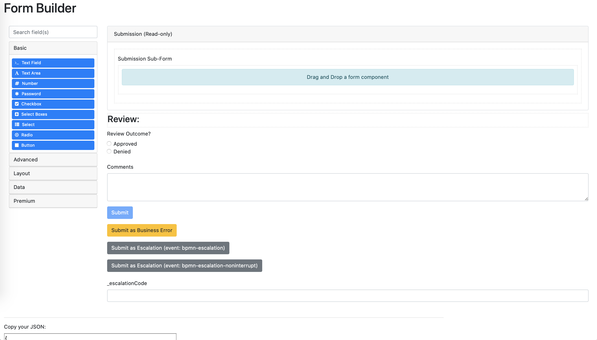
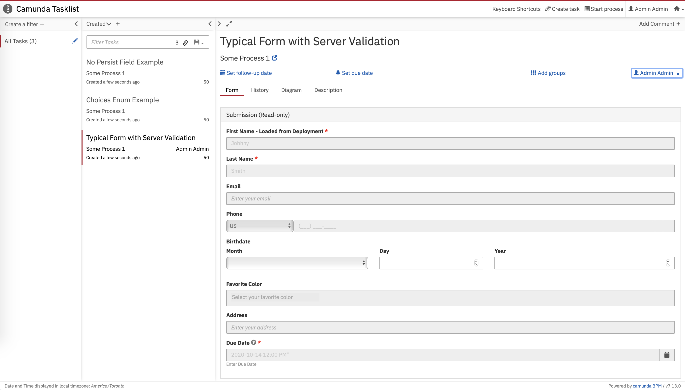
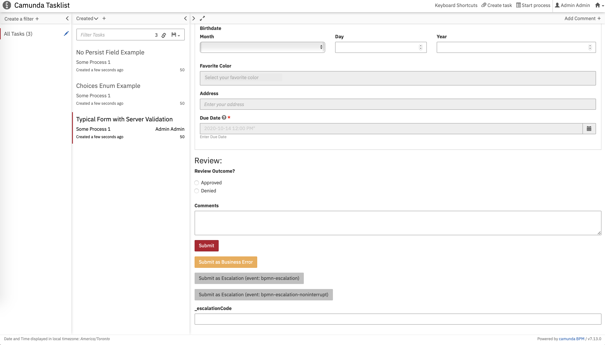
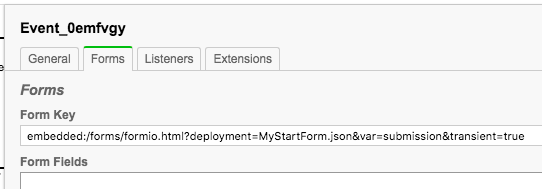
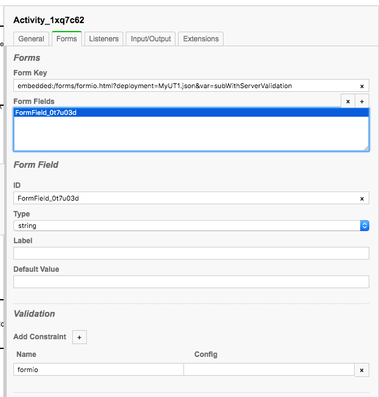
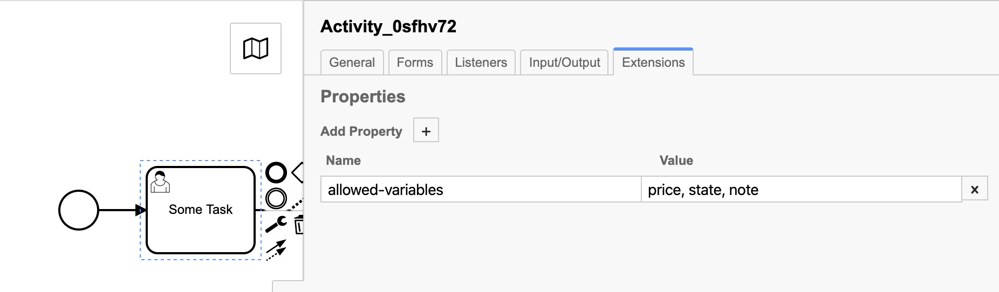
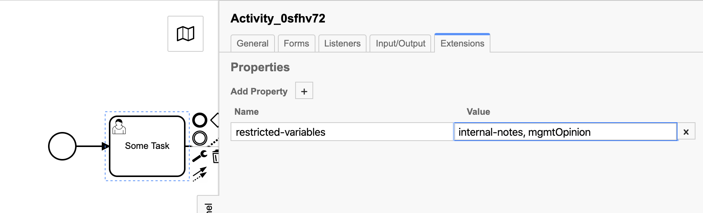

# Camunda Formio Plugin

Provides client-side and server-side integration for using Camunda Embedded Forms with Formio Forms.








## What does it do?

Allows you to configure *start-event* forms and *user-task* forms with a `formkey` that will load formio forms in Camunda Tasklist webapp.


## How do I set it up?!

Configuring Formio for a Start Form:




Configuring Formio for User Tasks:



If you want to add server side validation, you add a Validation Constraint with the name `formio`.  See the Server Validation 
section for more details.


## Installation

### Camunda SpringBoot Deployment

See the `springboot` folder for a example of the deployment

### Typical Camunda Deployment

See the `docker` folder for an example of the deployment using the Camunda Tomcat distribution


## Building Forms:

Local Builder: Deploy Webapp and access a local builder at: `http://..../forms/builder.html`

Hosted Builder: [https://formio.github.io/formio.js/app/builder](https://formio.github.io/formio.js/app/builder)


## Configure the BPMN

Example of Configuring a Start Form:

`embedded:/forms/formio.html?deployment=MyStartForm.json&var=submission&transient=true`

In this example, we use the `deployment` parameter to direct the use of the `MyStartForm.json` form schema which is found in the BPMN Deployment resources. 
We use the `var` parameter to direct the name of the process variable that will be created to store the form submission. 
We use the `transient` parameter to direct the process variable holding the form submission get created as a 
[transient variable](https://docs.camunda.org/manual/7.13/user-guide/process-engine/variables/#transient-variables) 


```xml
<bpmn:startEvent id="Event_0emfvgy"
                 camunda:formKey="embedded:/forms/formio.html?deployment=MyStartForm.json&#38;var=submission&#38;transient=true">
    <bpmn:outgoing>Flow_1ax32ut</bpmn:outgoing>
</bpmn:startEvent>
```


Example of Configuring a User Task:

`embedded:/forms/formio.html?deployment=MyUT1.json&var=subWithServerValidation


```xml
<bpmn:userTask id="Activity_1xq7c62" name="Typical Form with Server Validation"
               camunda:formKey="embedded:/forms/formio.html?deployment=MyUT1.json&#38;var=subWithServerValidation">
    <bpmn:extensionElements>
        <camunda:formData>
            <camunda:formField id="FormField_0t7u03d" type="string">
                <camunda:validation>
                    <camunda:constraint name="formio"/>
                </camunda:validation>
            </camunda:formField>
        </camunda:formData>
    </bpmn:extensionElements>
    <bpmn:incoming>Flow_0069xxd</bpmn:incoming>
    <bpmn:outgoing>Flow_18xtnen</bpmn:outgoing>
</bpmn:userTask>
```


### Configuration Options:

The following are the parameters that can be passed in the `formKey`:

| Parameter | Required? | Default | Description |
|---------------|-------------------|--------------|-----------------------|
|deployment=    | Yes or use path= | - | The .json file name in the deployment created through the API. |
|path=          | Yes or use deployment= | - | The file system path to the .json file. **Must start with a `/`** |
|transient=     | No | false | If true, then variable will be submitted as Transient, and thus not saved to database.  Use a Script Task or listener in the transaction to post-process the submission into the desired variable. |
|var=           | No | if start form then "startForm_submission", if user task then "`[taskId]`_submission"| Define a custom variable name for the form submission.  Will be submitted as a Process Variable.|

Examples:

1. `embedded:/forms/formio.html?deployment=MyUT1.json?transient=true&var=myCustomSubmission`
1. `embedded:/forms/formio.html?deployment=MyUT1.json?var=UT1-Submission`
1. `embedded:/forms/formio.html?path=/forms/MyStartForm.json` (where the MyStartForm.json was placed in the `src/main/webapp/forms` folder.  **Make sure your path starts with a `/`**)


### Configuration through Camunda Extension Properties

If you enable the `FormioParseListenerProcessEnginePlugin`, you can configure through Extension Properties rather than 
manually creating the formKey:


The same configuration options used in the formKey are used in the extension properties. 
Each extension property has a prefix of `formio_`.

For Server Validation you add a **name:** `formio_validation`, **value:** `true`.
 

## Submission Storage

When a successful submission occurs, a `json` variable will be created as a Process Instance Variable. 

Use [Camunda SPIN library](https://docs.camunda.org/manual/7.13/reference/spin/json/) to access the json variable properties.

Example in a gateway expression: `${someSubmission.prop('data').prop('someFieldKey').value()}`


### Resolving User Task `taskId` to more meaningful values

Very often the taskID (which is typically a UUID) will not be very meaningful.  If you require more meaningful variable names 
consider using the `var` parameter to set a custom variable name or use the Activity ID (the `id` property when you are in the Modeler on a user task activity).


## Trigger 'BPMN Errors'

Support is provided to trigger interrupting BPMN Errors:

Trigger a formio event with the name `bpmn-error` (typically with a button: set the button event to `bpmn-error`)

The default error code is `default`.  To set a custom error code, create a variable in the formio submission with the key 
`_errorCode`.  Typical use cases are to use a `text` component or a `hidden` component.

No error message is submitted by default.  To set a custom error message, create a variable in the formio submission with the key 
`_errorMessage`.  Typical use cases are to use a `text` component or a `hidden` component.

**The submission variable created through the bpmn-error cannot be validated using the formio server validator: this is a limitation in Camunda**

## Trigger 'BPMN Escalations'

Support is provided to trigger interrupting and non-interrupting BPMN Escalations.  Note that Camunda's form API does not 
make a distinction between interrupting and non-interrupting escalation events and therefore some best practices are implemented:

The escalation code is `default`.  To set a custom escalation code, create a variable in the formio submission with the key 
`_escalationCode`.  Typical use cases are to use a `text` component or a `hidden` component.

**The submission variable created through the bpmn-escalation cannot be validated using the formio server validator: this is a limitation in Camunda**

### Interrupting BPMN Escalations

To trigger BPMN Escalation that is designed to be used with a interrupting BPMN Escalation boundary event:

Trigger a formio event with the name `bpmn-escalation` (typically with a button: set the button event to `bpmn-escalaton`)

### Non-Interrupting BPMN Escalations

To trigger BPMN Escalation that is designed to be used with a non-interrupting BPMN Escalation boundary event:

Trigger a formio event with the name `bpmn-escalation-noninterrupt` (typically with a button: set the button event to `bpmn-escalaton-noninterrupt`)

A non-interrupting escalation means the user task will remain in the task list, and the submission variable name will be given a suffix of `_escalation`. 
The suffix is used to ensure if/when the user task is normally completed, the submission variable created through the 
user task completion does not overwrite the submission variable created through escalation.


## Deploying your Forms
 
### REST API Form Deployment

Forms can be deployed through the REST API.  The form JSON must be part of the same deployment as the BPMN.
 
If changes need to be made to the form, you must deploy a new .json file along with the BPMN.
 
An example of using Postman to deploy:
 


When using REST API Form deployments, use the `deployment` parameter in the form key such as: 
`embedded:/forms/formio.html?deployment=MyUT1.json`

### File System Forms Deployment (or other URLs)
 
Forms can be deployed on the file system and made available to the web application.  The common way to do this is 
through `src/main/webapp/forms` (or whatever folder you like within `webapp`).
 
If you want to make changes to the JSON, you can modify the JSON file without having to make a new BPMN deployment.
 
If you do not want to use the file system, you can deploy to another URL within the same domain as Camunda Webapps.  Then 
you can set your `formKey` to something like: `embedded:/forms/formio.html?deployment=http://example.com/forms/MyUT1.json`
 
The benefit of having your form/JSON outside of the BPMN deployment is you are not required to redeploy the BPMN each 
time you make changes to the form, but in many use cases you will want to tie your BPMN and forms together 
within the same deployment for versioning purposes.
 
## Example Submission
 

 
 ```json
{
  "data": {
    "firstName": "SomeFirstName",
    "lastName": "SomeLastName",
    "email": "",
    "phoneNumber": {
      "value": "",
      "maskName": "US"
    },
    "select": [],
    "address": {},
    "dueDate": "2020-08-18T12:00:00-04:00",
    "birthdate": "00/00/0000",
    "submit": false
  },
  "metadata": {
    "timezone": "America/Montreal",
    "offset": -240,
    "origin": "http://localhost:8080",
    "referrer": "http://localhost:8080/camunda/app/welcome/default/",
    "browserName": "Netscape",
    "userAgent": "Mozilla/5.0 (Macintosh; Intel Mac OS X 10_13_6) AppleWebKit/605.1.15 (KHTML, like Gecko) Version/13.1.2 Safari/605.1.15",
    "pathName": "/camunda/app/tasklist/default/",
    "onLine": true
  },
  "state": "submitted"
}
```


## Variable Fetching in Formio

Formio will fetch variables based on configurations in the component configuration.

Under the API tab of a component create a custom property with the following format:

**key:** `fetchVariable`  **value:** `variableName` (recommended not to use spaces in variable names)

Once you get your variable, use the Default Value Population feature to populate your field with the data returned from the variable fetch.


## Default Value Population

Make sure to fetch the variables using the `fetchVariable` configuration.

### Simple Configuration

The simple configuration provides a rapid setup option allowing most common use case access to variables.

In the form component's API tab, set a custom property with key: `camVariableName` and the value being the dot notation path.

Example:

1. Given a simple camunda string variable named "firstName", the key-value configuration would be:
   
   `camVariableName: firstName`

1. Given a previous formio form submission which is saved as a Camunda Json variable, the key-value configuration would be: 

   `camVariableName: somePreviousSubmission.data.firstName` 


If the variable is type Json and you would like to print out the json into the form field, add a property in the API tab with the configuration:

Key:`stringify`

Value: `true` (If you are manipulating the raw json, this should be an equivalent of `"true"`)


### Advanced Configuration

The advanced configuration provides javascript access to the variables, allowing complex configurations 
such as variable manipulation, merging, trim, etc.

Use the Custom Default Value Javascript feature in Formio to parse the returned variables.

Variables get stored in `$scope.camForm.formioVariables`

In the Custom Default Value configuration you can use the following to access the object of variables:

```js
let variables = angular.element('#task-form-formio').scope().camForm.formioVariables
```

Variables names are the keys.

If the variable is type `Json` it is automatically available as a JS Object.

### Example

Set the default value of a Text field "First Name" with the `firstName` property that was submitted in the Start Form (a formio form submission)

In the First Name field's Custom Default Value configuration use the following: 

```js
let variables = angular.element('#task-form-formio').scope().camForm.formioVariables

value = variables.postProcessed_submission.data.firstName
```

The code `angular.element('#task-form-formio').scope()` is re-capturing the Camunda task form angular scope from the `<form id="task-form-formio>` element.

Formio based submissions place the form submission data inside of the `data` object.

Common use case would be to set the First Name field as read-only if it is for display purposes.

1. Configure the Component: 

   

1. Go to the Data tab: 

   

1. Scroll down to Custom Default Value: 

   

1. Add your JS logic for selecting your default value: 

   

1. Go to the API tab: 

   

1. Create a Custom property with key `fetchVariable`, and the value of the variable you want to work within your JS in step 4.
 
   
   

## Server Validation (Validating submissions against the schema on the server)

From submissions can optionally be enabled with server-side validation by the Formio server-side validation.

To enable server-side validation of a *start-form* or *user-task*:

1. add a "validation constraint" in the form fields configuration. 

1. Set any field type, and create a constraint with the key/name "formio":

   

1. Deploy the [form-validation-server](https://github.com/StephenOTT/Form-Validation-Server)

1. Configure the Plugin `FormioFormFieldValidationProcessEnginePlugin.class`.
The plugin has the following parameters:
   1. `validationUrl` : The validation url to send submissions to.  Defaults to `localhost:8081/validate`.
   1. `validationTimeout` : The milliseconds to wait before timeout of the Validation Url HTTP request.  Defaults to `10000` 10 seconds.
   1. `validationHandler` : The bean instance that will execute the Formio Validation.  Defaults to an instance of `SimpleFormioValidationHandler.class`.  Override this configuration if you have special validation handling requirements.


## Subforms / Nested Forms

You can nest forms using the `container` component.  The `container` component is used to gather form values into a nested 
JSON object.

### Subform usage

1. Add a container to your form
1. In the api properties tab set a component property of:
   1. Key: `subform` value: `deployment=mySubForm.json` or `path=/my/path/mySubForm.json`

The `subform` property value uses the same format as the formkey parameters.

Typical use cases is to set the container to "disabled", then the nested form is read-only and you display the 
form of a previous submission.

### Hide Subform buttons

The submit button will be hidden by default.  If you want to hide all buttons on your subform add a additional property 
to the container:

 - Key: `hideButtons`  value: `true` (this should be a string value)

### Subform Pre-population

If you want to populate the subform with values from a variable, use the `camVariableName` property.  You can access previous 
form submissions with Key: `camVariableName`  value: `myPreviousSubmissionJsonVariable.data`. The data object, which is what 
Formio places all submission data into, will then be populated into the subform.

It is the responsibility of the parent form to provide variable resolution for any fields in the subform.  Subforms with 
form components that have `camVariableName` or `fetchVariable` properties will be ignored.  This may change in the future.

## File Uploads

Use the `file` component, and use the Base64 storage format.  The file will be uploaded as part of the JSON submission to camunda.

You can display you file upload in a formio form by returning the base64 value into a readonly/disabled form (such as using subforms).

Typical use case would be to upload the file as JSON/base64 as part of the form submission, and then handle transitive modifications of the file 
into other storage formats, and drop the base64 value from the submission / replace with other values pointing to a long term 
storage format (such as a blob/file storage container) 

## Get-Form-Variables Command Security Plugin

The plugin `GetFormVariablesSecurityProcessEnginePlugin.class` provides variable security using Camunda Extension 
Properties on a User Task.

Plugin full path: `com.github.stephenott.camunda.tasks.forms.command.GetFormVariablesSecurityProcessEnginePlugin`

The plugin provides two types of variable security:

1. `allowed-variables` : a comma separated list of variable names that can be accessed using the endpoint `GET /task/{id}/form-variables` or the java api (getFormVariables).
1. `restricted-variables` : a comma separated list of variable names that cannot be accessed using the endpoint `GET /task/{id}/form-variables` or the java api (getFormVariables).

`allowed-variables` is used to control the exact list of variables that can be accessed.  Any variables that are not part of this list will be removed from the result.  No error will be thrown.

`restricted-variables` is used to control which variables cannot be accessed.  Any variables that are part of this will be removed from the result.  No error will be thrown.

Example:





 