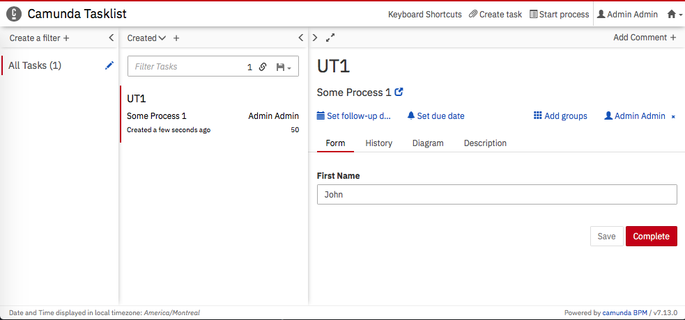
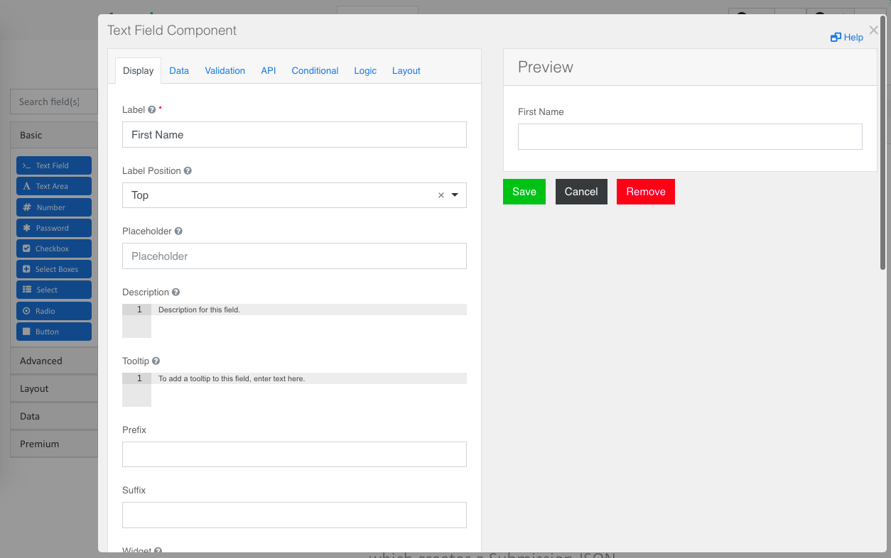
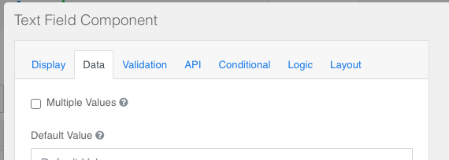
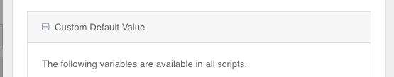
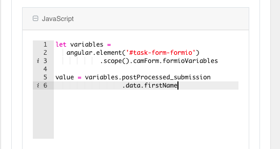
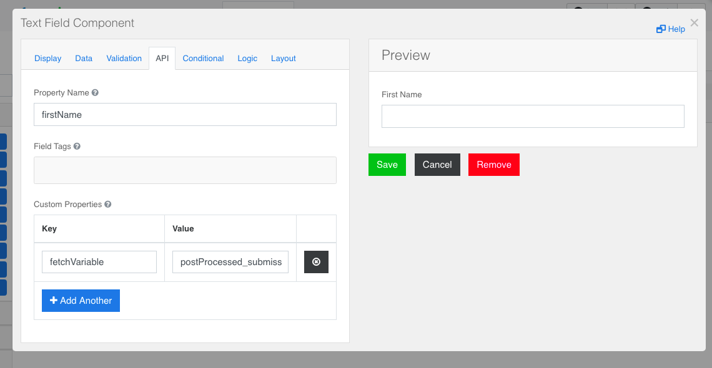
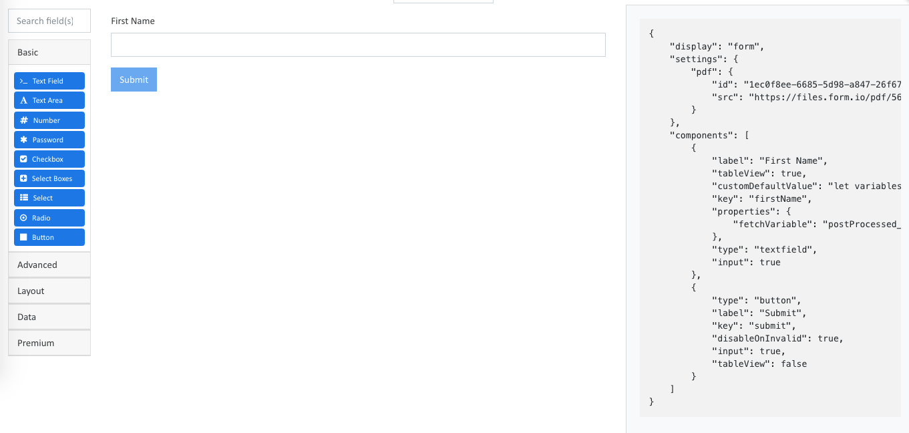

# Camunda Formio Plugin

Provides integration for using Camunda Embedded Forms with Formio Form Renderer.

Using Formio for a Start Form:

> 

Using Formio for User Tasks:

> 


## What does it do?

Allows you to configure start-event forms and user-task forms with a `formkey` that can trigger formio form renders in Camunda Tasklist webapp.


## Configure the BPMN

Configuring a Start Form:

`embedded:/forms/formio.html?deployment=MyStartForm.json`

>

Configuring a User Task:

`embedded:/forms/formio.html?deployment=MyUT1.json`

>


### Configuration Options:

| Parameter | Required? | Default | Description |
|---------------|-------------------|--------------|-----------------------|
|deployment=    | Yes or use path= | - | The .json file name in the deployment created through the API. |
|path=          | Yes or use deployment= | - | The file system path to the .json file. |
|transient=     | No | false | If true, then variable will be submitted as Transient, and thus not saved to database.  Use a Script Task or listener in the transaction to post-process the submission into the desired variable. |
|var=           | No | if start form then "startForm_submission", if user task then "`[taskId]`_submission"| Define a custom variable name for the form submission.  Will be submitted as a Process Variable.|

Examples:

1. `embedded:/forms/formio.html?deployment=MyUT1.json?transient=true&var=myCustomSubmission`
1. `embedded:/forms/formio.html?deployment=MyUT1.json?var=UT1-Submission`
1. `embedded:/forms/formio.html?path=/forms/MyStartForm.json` (where the MyStartForm.json was placed in the `src/main/webapp/forms` folder)


## Installation

### Camunda SpringBoot Deployment

...

### Typical Camunda Deployment

...


## Submission storage

When a successful submission occurs, a `json` variable will be created as a Process Instance Variable.  


### Resolving User Task `taskId` to more meaningful values

Very often the taskID (which is typically a UUID) will not be very meaningful.  If you require more meaningful variable name 
consider using the Activity ID (the `id` property when you are in the Modeler on a user task activity).

Use input/output mappings to control modification of the variables.

If you do not want to use the taskId, then see the `var` configuration option to customize the variable name. 


## Building Forms:

You can build your form and copy the JSON from: [https://formio.github.io/formio.js/app/builder](https://formio.github.io/formio.js/app/builder`)

Remove the `Submit` button as it is not required / it will not be used.


## Deploying your Forms
 
### REST API Form Deployment

Forms can be deployed through the REST API.  The form JSON must be part of the same deployment as the BPMN.
 
 If changes need to be made to the form, you must deploy a new .json file along with the BPMN.
 
The BPMN and the JSON files must be part of the same deployment.
 
An example of using Postman to deploy:
 


The `Form Key` in the BPMN will use the `deployment=` parameter.

### File System Forms Deployment (or other URLs)
 
 Forms can be deployed on the file system and made available to the web application.  The common way to do this is 
 through `src/main/webapp/forms` (or whatever folder you like within `webapp`).
 
 If you want to make changes to the JSON, you can modify the json directly without having to make a new deployment.
 
 If you do not want to use the File System, you can deploy to another URL within the same domain as Camunda Tasklist.  Then 
 you can set your Form Key to something like: `embedded:/forms/formio.html?deployment=http://example.com/forms/MyUT1.json`
 
 The benefit of having your form/JSON outside of the Camunda BPMN Deployment is you are not required to redeploy the BPMN each time you make changes to the form.  
 But in many use cases you will want to tie your BPMN and Forms together within the same deployment for versioning purposes.
 
## Example Submission
 
> 

> 
 
 ```json
{
  "data": {
    "firstName": "SomeFirstName",
    "lastName": "SomeLastName",
    "email": "",
    "phoneNumber": {
      "value": "",
      "maskName": "US"
    },
    "select": [],
    "address": {},
    "dueDate": "2020-08-18T12:00:00-04:00",
    "birthdate": "00/00/0000",
    "submit": false
  },
  "metadata": {
    "timezone": "America/Montreal",
    "offset": -240,
    "origin": "http://localhost:8080",
    "referrer": "http://localhost:8080/camunda/app/welcome/default/",
    "browserName": "Netscape",
    "userAgent": "Mozilla/5.0 (Macintosh; Intel Mac OS X 10_13_6) AppleWebKit/605.1.15 (KHTML, like Gecko) Version/13.1.2 Safari/605.1.15",
    "pathName": "/camunda/app/tasklist/default/",
    "onLine": true
  },
  "state": "submitted"
}
```


## Variable Fetching from Formio

Formio will fetch variables based on configurations in the component configuration.

Under the API tab of a component create a custom property with the following format:

**key:** `fetchVariable`  **value:** `variableName` (recommended not to use spaces in variable names)

Once you get your variable, use the Default Value Population feature to populate your field with the data returned from the variable fetch.

## Default Value Population

Use the Custom Default Value Javascript feature in Formio to parse the returned variables.

Variables get stored in `$scope.camForm.formioVariables`

In the Custom Default Value configuration you can use: `let variables = angular.element('#task-form-formio').scope().camForm.formioVariables` 
to access the object of variables.  Variables names are the Keys.

If the variable is type `Json` it is automatically available as a JS Object.

### Example

Set the default value of a Text field "First Name" with the `firstName` property that was submitted in the Start Form (a formio form submission)

In the First Name field's Custom Default Value configuration use the following: 

```js
let variables = angular.element('#task-form-formio').scope().camForm.formioVariables

value = variables.postProcessed_submission.data.firstName
```

The code `angular.element('#task-form-formio').scope()` is re-capturing the Camunda task form angular scope from the `<form id="task-form-formio>` element.

Formio based submissions place the form submission data inside of the `data` object.

Common use case would be to set the First Name field as read-only if it is for display purposes.

1. Configure the Component: 
   

1. Go to the Data tab: 
   

1. Scroll down to Custom Default Value: 
   

1. Add your JS logic for selecting your default value: 
   

1. Go to the API tab: 
   

1. Create a Custom property with key `fetchVariable`, and the value of the variable you want to work within your JS in step 4. 
   